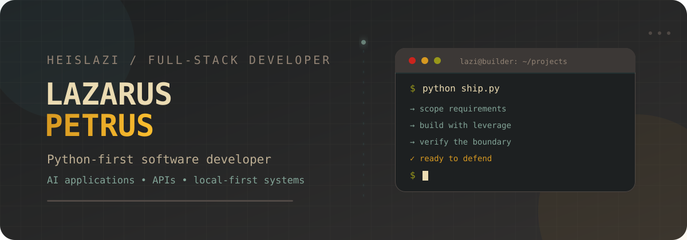
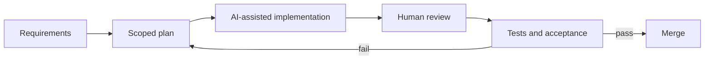

<div align="center">



[](https://git.io/typing-svg)

[](mailto:lazi11petrus@gmail.com)
[](https://github.com/HeisLazi)
[](#)

</div>

## I'm Lazi 🦦

Yea umm so I'm a **product-focused software developer** and Computer Science student based in Windhoek, Namibia. I currently work as a **Software Development Intern at Edge Technology Solutions**, where I turn operational needs and ambiguous ideas into structured requirements, thoughtful interfaces, and human-reviewed software.

My work currently spans requirements analysis, product and UI design, frontend development, QA, and delivery management. I create the product direction, user flows, interface decisions, and acceptance criteria; AI assists with implementation, while I remain responsible for scope, design quality, testing, verification, and final acceptance. I also have backend and deployment experience with Supabase, Vercel and Cloudflare.

```python
lazarus = {
    "role": "Product-focused software developer",
    "focus": ["Requirements analysis", "Product design", "UI design", "QA"],
    "delivery": "AI-assisted implementation with human direction and verification",
    "platform_experience": ["Supabase", "Cloudflare"],
    "degree": "BSc Computer Science — Software Development",
    "principle": "Speed matters. Correctness still owns the merge button.",
}
```

## What I bring

- **Requirements analysis** - translating ambiguous ideas and operational needs into clear scope, user flows and acceptance criteria.
- **Product and UI design** - owning product direction, interaction decisions and interface design, with AI used as an implementation assistant.
- **Frontend development** - building and refining usable interfaces across JavaScript, React, Next.js, HTML and CSS.
- **AI-assisted delivery** - coordinating planning and implementation while keeping human judgment in charge of design, architecture and acceptance.
- **Product restraint and AI-slop elimination** - removing generic AI patterns, unnecessary features, redundant abstractions and visual noise so each product stays focused, distinctive and viable.
- **QA and verification** - testing, type checks, builds, manual acceptance and security-boundary review.
- **Backend and platform experience** - integrating application services and deployments with Supabase, Vercel and Cloudflare.

## Featured work

| Project | What it demonstrates | Status |
|:---|:---|:---:|
| [**AI Skill Video Extractor**](https://github.com/HeisLazi/ai-skill-video-extractor) | Python pipeline that converts YouTube videos into structured, reviewable evidence for reusable AI-agent skills. Includes versioned schemas, uncertainty tracking, deduplication, cost controls and offline tests. | Public |
| [**Productivity Web Application**](https://github.com/HeisLazi/Productivity-Web-Application) | A Next.js productivity workspace with task and event management, hierarchical notes, local persistence and an interactive timeline. | Public |
| **InstaClip** | Local-first desktop workspace for turning long-form VODs into reviewable short-form clip candidates using transcription, multi-signal detection and AI-assisted ranking. | Private beta |
| **CNTKNW** | Offline reading, annotation and knowledge environment designed around durable local data, page provenance and a continuous journal. | In development |

> Some active repositories remain private while they contain company work, unreleased product code or early-stage experiments. Public case studies and sanitized technical write-ups will be added as they become suitable for release.

## Skills, honestly labelled

<div align="center">

**Strongest**


**Working knowledge**


**Frontend project experience / currently deepening**


**Tools and project exposure**


</div>

## How I use AI in development



AI helps me implement faster, but it does not create my product direction or UI decisions. I remain responsible for requirements, user experience, architecture, reviewing generated changes, correcting failures, testing and final acceptance. That includes removing AI-induced bloat and generic patterns before they reach the product.

## GitHub activity

<div align="center">


</div>

## Current direction

- Improving InstaClip toward a reliable private beta.
- Strengthening frontend engineering, product design and UI design through working applications.
- Deepening backend and deployment experience with Supabase and Cloudflare.
- Turning private project experience into sanitized public case studies.
- Completing a Bachelor of Computer Science in Software Development at NUST, expected April 2027.

---

<div align="center">

### Build quickly. Review carefully. Ship what can be defended.

Open to **part-time, remote and project-based opportunities** outside standard working hours.


</div>
